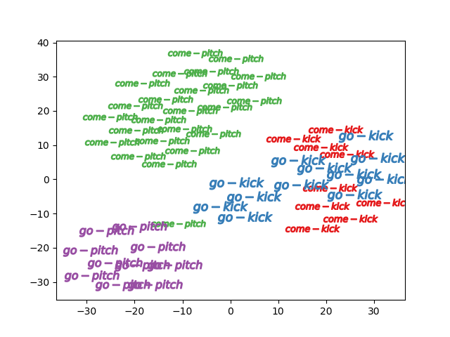
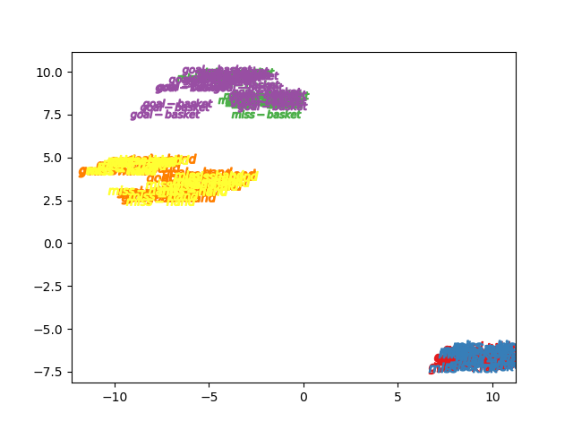
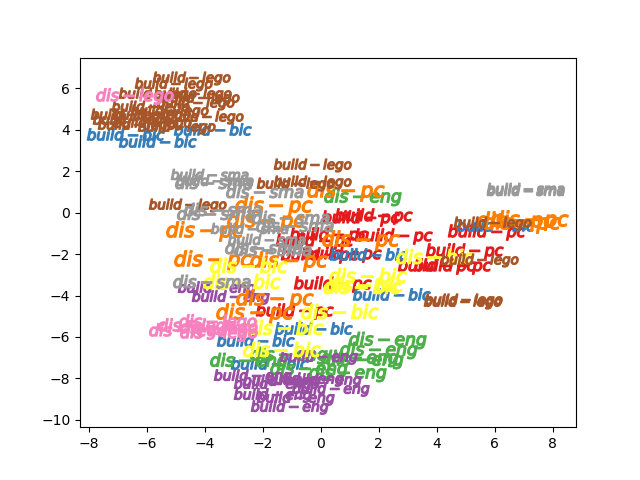

# Abstract concept video machine learning and Dataset  
high-order abstract concept machine learning using 3DCNN and new dataset  

## overview  
The final goal is to develop system  
that can improve its intelligence and knowledge by itself infinitely  

As the first step,  
Automatic unsupervised acquisition of abstract concept from video was experimented  
using codes in this repository  

## semi Abstract Concept Video Dataset : sACVD  

This dataset consists of infomation about approximately 1600 scenes from youtube creative commons license(when it's searched) videos,  
and covers 22 sub categories(concrete concepts) and 6 main categories(abstract concepts)  

And often video machine learning rely on just objects, not action to classify.  
For example, some system output "soccer" label just seeing "uniform" or "soccer ball" of the video.  
For real understanding of action or video,  
we need to eliminate the effect the objects  
so the scene in the same class was collected from videos which have similar composition of objects.  

The dataset is located at "data/abstract_video_dataset.csv"  

The first goal is learning abstract concepts using main category labels,  
the second goal is learning abstract concepts only using sub category labels.  

|main_category |narrow_sense |sub_category |  
|---|---|---|  
|go |go |baseball pitcher |  
|come |come |baseball pitcher|  
|go |go |run training|  
|come |come |run training|  
|go |go |free kick keeper come go|  
|come |come |free kick keeper come go|  
|make |build |lego build|  
|break |disassemble |lego disassemble|  
|make |build |assemble a pc|  
|break |disassemble |disassemble a pc|  
|make |build |smartphone assemble|  
|break |disassemble |smartphone disassemble|  
|make |build |assemble bicycle|  
|break |disassemble |disassemble bicycle|  
|make |build |assemble engine|  
|break |disassemble |disassemble engine|  
|succeed |goal |free kick|  
|fail |miss |free kick|  
|succeed |goal |basketball game|  
|fail |miss |basketball game|  
|succeed |goal |handball game|  
|fail |miss |handball game|  

## Requirements  
Python 3.6.8 :: Anaconda, Inc.    
pytorch 1.1  
torchvision 0.3.0  

## how it works  
Firstly, video classification was conducted and accuracy was measured.  

The video classification 3DCNN architecture is almost the same as ECOlite architecture   
shown in "ECO: Efficient Convolutional Network for Online Video Understanding" M. Zolfaghari et al.  

Then, after training with sub category labels which indicates relatively concrete visual concepts,  
video vector features were visualized by t-sne  
and checked if the abstract concepts were learned or not.  

Training were started from scratch,  
not using any pretrained weight to avoid learning unpredicted knowledge  

## experimental results  

#### accuracy of main category classification  

|main_category |train accuracy(%) |valid accuracy(%) |  
|---|---|---|  
|come, go(2 classes) |80.0 |96.7 |  
|build, disassemble(2 classes) |74.3 |71.0 |  
|goal, miss(2 classes) |60.5 |55.5 |  

#### accuracy of sub category classification  

|sub_category |train accuracy(%) |valid accuracy(%) |  
|---|---|---|  
|come, go(6 classes) |70.7 |70.0 |  
|build, disassemble(10 classes) |76.8 |38.0 |  
|goal, miss(6 classes) |57.2 |36.4 |  

## visualization with t-sne for 3 main category concepts  
#### come, go concept  
  

#### goal, miss concept  
video features are strongly affected by visual objects  
  

#### build, disassemble concept  
  

## references  
[1]"ECO: Efficient Convolutional Network for Online Video Understanding" M. Zolfaghari et al.  
[2]"Can spatiotemporal 3d cnns retrace the history of 2d cnns and imagenet?" Kensho Hara et al.  

## license  
MIT license    
<a href="https://creativecommons.org/licenses/by/4.0/" target="_blank">creative commons by 4.0</a> for semi Abstract Concept Video Dataset:sACVD  
